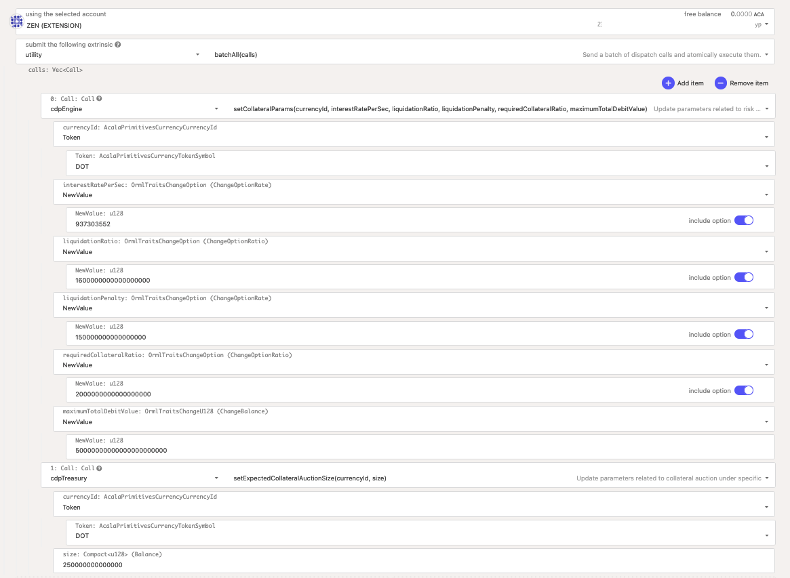

# 添加/更新抵押资产

任何人都可以提交提案，可以是新增一种抵押资产，更新当前风险参数。这个过程同给Acala/Kaura网络递交提案没有区别&#x20;

* [在Acala网络上递交提案](https://wiki.acala.network/get-started/acala-network/governance)
* [在Karura网络上递交提案](https://wiki.acala.network/get-started/get-started/governance)

我们将概述如下的一个原像提案，该提案建议新增一种抵押资产：

下面这个例子列举了如添加DOT作为新的抵押资产所要涉及的参数：

* 稳定费
* 清算率
* 清算罚金
* 所需抵押率
* 债务上限
* DOT 抵押拍卖额度

注意: 为当前抵押资产更新风险参数需使用相同的 extrinsics, 并且你只需输入要更改的参数，保持其他参数不变&#x20;

下面是上述例子的编码调用数据，你可以把他粘贴到 [Polkadot Web App](https://polkadot.js.org/apps) - 选择链 - `Developer` - `Extrinsics` - `Decode`

> 0x030208680300020101001ede3700000000000000000000000001010000a0d8855734160000000000000000010100004f8c34e81402000000000000000001010000c84e676dc11b0000000000000000010000407ba5f06381960a000000000000670200020b00a031a95fe3
